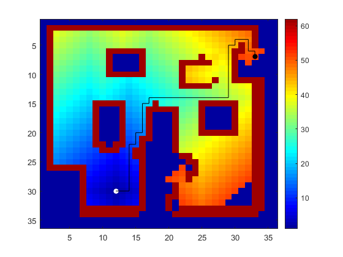

Wavefront algorithm finds the shortest path between two points.

Project in course Autonomous Systems at the University of Las Palmas de Gran Canaria, April 2020. 

Some functions and the input data were provided by the teacher and are not included.

